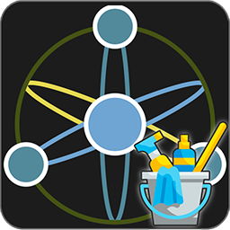

<p align="center">
  
</p>
<h1 align="center">AtomCleaner</h1>
<p align="center">
  <strong>Curador</strong> — Herramienta de rescate y migracion desde Blogger a Astro+Supabase
</p>

<p align="center">
  
  
  
  
  
  
  
</p>

---

## Que es AtomCleaner?

AtomCleaner es una aplicacion web para **importar, limpiar, curar y exportar** posts de un blog de Blogger (archivos `.atom` / `.xml`) con el objetivo de republicarlos en un sitio Astro con Supabase como backend.

No es solo un parser XML: es un **centro de curaduria completo** que detecta contenido roto, identifica plataformas muertas de la era dorada de internet, calcula indices de nostalgia y genera **Museum Cards** listas para pegar en un editor Quill.

### Para que sirve?

- **Rescatar posts antiguos** (2009-2012) de un blog de Blogger
- **Detectar contenido roto**: imagenes de hosts muertos (Imageshack, Photobucket, Tinypic...), embeds de Flash, contenido vacio
- **Identificar referencias a plataformas extintas**: Megavideo, Megaupload, Google+, MSN Messenger, Flash Player, Windows XP y 30+ plataformas mas
- **Calcular metricas de nostalgia** y un Indice Fumico para cada post
- **Generar Museum Cards** HTML listas para Quill/Astro con CSS custom properties
- **Exportar** en JSON (Supabase-ready), Markdown, HTML o Museo HTML con tracking de publicacion

---

## Inicio rapido

### Requisitos

- Node.js 18+
- npm, bun o pnpm

### Instalacion

```bash
git clone https://github.com/MozzVader/AtomCleaner.git
cd AtomCleaner
npm install
npx prisma db push    # Crear la base de datos SQLite
npm run dev           # Iniciar en http://localhost:3000
```

### Uso basico

1. **Arrastrar** un archivo `.atom` o `.xml` (exportacion de Blogger) a la zona de carga
2. Revisar los posts en el dashboard: usar filtros por tipo, estado, etiqueta o busqueda
3. Cambiar estados (Aprobado / Pendiente / Descartado / Necesita edicion) individual o masivamente
4. Previsualizar cada entrada: contenido renderizado, HTML crudo, o Museum Card
5. **Copiar** el snippet HTML del Museum Card y pegarlo directamente en Quill
6. **Exportar** en el formato deseado cuando este listo

---

## Funcionalidades principales

### Importacion y parseo

- Soporta archivos `.atom` y `.xml` exportados desde Blogger
- Parser XML multi-estrategia: detecta automaticamente el formato del archivo (con o sin namespaces, variantes de Blogger)
- Cross-validacion de URLs: corrige dominios incorrectos del feed comparando contra los links de los posts individuales
- Separacion automatica de posts, paginas, borradores y comentarios
- Deteccion de comentarios y vinculo con su post padre
- Calculo automatico de conteo de palabras y etiquetas

### Deteccion de contenido roto

| Icono | Issue | Descripcion |
|:---:|---|---|
| 🖼️ | Imagenes muertas | Detecta referencias a Imageshack, Photobucket, Tinypic, Subefotos, Picoodle |
| 🔶 | Embeds Flash | Objeto `<object>` / `<embed>` con archivos `.swf` |
| 📝 | Sin titulo | Posts sin titulo (comunes en imports rotos) |
| ⚠️ | Contenido vacio o minimo | Posts con menos de 20 palabras |

### Deteccion de plataformas (30+)

AtomCleaner escanea el contenido de cada post buscando referencias a plataformas y tecnologias extintas, organizadas en 7 categorias:

| Categoria | Plataformas detectadas |
|---|---|
| **Video hosting** | Megavideo, Megaupload, Putlocker, Videoweed, Novamov, Movshare, Stagevu, DivxStage, Duckload, FileServe, FileSonic, RapidShare, 4shared |
| **Image hosting** | Imageshack, Photobucket, Tinypic, Subefotos, Imagebam |
| **Redes sociales** | Google+, Orkut, Hi5, MySpace, Vine |
| **Mensajeria** | MSN Messenger, ICQ, Yahoo Messenger |
| **Tecnologias** | Flash Player, Shockwave, Silverlight, Java Applet, Internet Explorer 6-8 |
| **Servicios** | Google Reader, StumbleUpon |
| **Sistemas operativos** | Windows XP, Windows 7 |

### Metricas del Museo

#### Nivel de Nostalgia (0-100%)

Puntuacion ponderada basada en:

- **Antiguedad del post**: 2009 = 30%, 2010 = 25%, 2011 = 20%, 2012 = 15%, 2013+ = 10%
- **Plataformas muertas detectadas**: cada una aporta un peso segun su rareza (Flash = 15pts, Megavideo = 12pts, MSN = 8pts, etc.)

Un post de 2009 con Flash + Megavideo + MSN + WinXP puede llegar a ~70%. Un post de 2012 sin plataformas muertas ronda el 15%.

#### Indice Fumico (0-100%)

Mide el nivel de "humo" (contenido que ya no funciona):

- Basado en plataformas muertas + issues de contenido
- 5 niveles: Leve (0-20), Moderado (21-40), Moderado-Alto (41-60), Alto (61-80), Humo Total (81-100)

### Museum Cards

El output principal para la republicacion. Cada post genera un snippet HTML con:

- **CSS custom properties** (`--percent`, `--humo`) en el div raiz que Astro usa para los graficos
- **Grafico circular** de nostalgia via CSS puro
- **Barra de humo** con nivel descriptivo
- **Platform tags** inteligentes: detectadas o fallback (youtube, imagenes, dominio referenciado, web)
- **Changelog de curacion** siempre presente (entries reales o `[CHORE] Revision de contenido`)
- **Badge "Post Rescatado"** como link al post original
- **Clases exactas** para CSS de Astro, sin atributos extra, sin estilos inline que rompan Quill

```html
<div class="museum-card" style="--percent: 87%; --humo: 60%;">
    <div class="museum-card-header">
        <a class="badge" href="https://..." target="_blank" rel="noopener noreferrer"
           style="color:inherit;text-decoration:none;display:inline-flex;align-items:center">
            <i class="material-icons" style="font-size:14px">history</i> Post Rescatado
        </a>
        <div class="original-date">Publicado originalmente: <strong>15 de agosto de 2009</strong></div>
    </div>
    <div class="museum-card-body">
        <!-- metricas -->
    </div>
    <div class="curation-changelog">
        <!-- log de curacion -->
    </div>
</div>
```

### Exportacion

| Formato | Uso |
|---|---|
| **JSON** | Importar a Supabase (slug, labels, author, original_url) |
| **Markdown** | Conversion via Turndown con metadatos |
| **HTML** | Pagina visual de revision con status y etiquetas |
| **Museo HTML** | HTML standalone con cards + contenido + toggles de publicacion |

El **Museo HTML** incluye:
- Checkboxes por entrada para marcar como publicado
- Barra de progreso sticky con contador en vivo
- Contadores: Total, Publicados, Alta nostalgia, Con humo, Con plataformas
- Botones "Marcar todos" / "Desmarcar todos"
- Posts descartados en opacidad reducida con badge rojo
- Entries publicados con borde verde

Filtros de exportacion: Todos / Aprobados+Edicion / Aprobados / Necesitan Edicion / Pendientes / Descartados.

---

## Arquitectura tecnica

```
src/
├── app/
│   ├── page.tsx              # SPA principal (upload + dashboard + preview)
│   └── api/
│       ├── upload/           # POST: parsear .atom y guardar en DB
│       ├── entries/          # GET: listar / PATCH: bulk status update
│       ├── entries/[id]/     # GET: detalle / PATCH: status individual
│       ├── export/           # GET: exportar JSON/MD/HTML/Museum
│       ├── museum-card/[id]/ # GET: generar card HTML de una entrada
│       └── stats/            # GET: estadisticas agregadas
├── lib/
│   ├── atom-parser.ts        # Parser XML, deteccion de issues/plataformas, scoring
│   ├── exporter.ts           # Generacion de Museum Cards y exportacion
│   ├── store.ts              # Estado global (Zustand + localStorage)
│   └── db.ts                 # Cliente Prisma (SQLite)
└── components/ui/            # Componentes shadcn/ui
```

| Capa | Tecnologia |
|---|---|
| Framework | Next.js 16 (App Router, standalone output) |
| UI | React 19, Tailwind CSS 4, shadcn/ui (New York) |
| Estado | Zustand con persist middleware |
| Base de datos | SQLite via Prisma ORM |
| XML | fast-xml-parser (multi-estrategia) |
| Markdown | Turndown |
| Iconos | Lucide React |
| Tema | next-themes (dark/light) |
| Tipografia | Geist Sans + Geist Mono |

---

## API

| Metodo | Endpoint | Descripcion |
|---|---|---|
| `POST` | `/api/upload` | Subir y parsear archivo Atom XML |
| `GET` | `/api/entries?status=&type=&label=&search=&sortBy=&sortOrder=&page=&limit=` | Listar entradas (filtros, paginacion, ordenamiento) |
| `PATCH` | `/api/entries` | Actualizar estado masivamente |
| `GET` | `/api/entries/[id]` | Obtener entrada completa |
| `PATCH` | `/api/entries/[id]` | Cambiar estado individual |
| `GET` | `/api/export?format=&status=` | Exportar (json/markdown/html/museum-html) |
| `GET` | `/api/museum-card/[id]` | Generar Museum Card de una entrada |
| `GET` | `/api/stats` | Estadisticas agregadas |
| `POST` | `/api/reset` | Eliminar todas las entradas |

---

## Licencia

Este proyecto esta licenciado bajo **Creative Commons Attribution-NonCommercial 4.0 International (CC BY-NC 4.0)**.

Podes copiar, modificar y redistribuir este material, pero no con fines comerciales y debe darse credito apropiado.

<details>
<summary>Ver texto completo de la licencia</summary>

```
Creative Commons Attribution-NonCommercial 4.0 International (CC BY-NC 4.0)

Attribution-NonCommercial 4.0 International

CC BY-NC 4.0

CREATIVE COMMONS CORPORATION IS NOT A LAW FIRM AND DOES NOT PROVIDE
LEGAL SERVICES. DISTRIBUTION OF THIS LICENSE DOES NOT CREATE AN
ATTORNEY-CLIENT RELATIONSHIP. CREATIVE COMMONS PROVIDES THIS
INFORMATION ON AN "AS-IS" BASIS. CREATIVE COMMONS MAKES NO WARRANTIES
REGARDING THE INFORMATION PROVIDED, AND DISCLAIMS LIABILITY FOR
DAMAGES RESULTING FROM ITS USE.

License

THE WORK (AS DEFINED BELOW) IS PROVIDED UNDER THE TERMS OF THIS
CREATIVE COMMONS PUBLIC LICENSE ("CCPL" OR "LICENSE"). THE WORK IS
PROTECTED BY COPYRIGHT AND/OR OTHER APPLICABLE LAW. ANY USE OF THE
WORK OTHER THAN AS AUTHORIZED UNDER THIS LICENSE OR COPYRIGHT LAW IS
PROHIBITED.

BY EXERCISING ANY RIGHTS TO THE WORK PROVIDED HERE, YOU ACCEPT AND AGREE
TO BE BOUND BY THE TERMS OF THIS LICENSE. TO THE EXTENT THIS LICENSE
MAY BE CONSIDERED TO BE A CONTRACT, THE LICENSOR GRANTS YOU THE RIGHTS
CONTAINED HERE IN CONSIDERATION OF YOUR ACCEPTANCE OF SUCH TERMS AND
CONDITIONS.

1. Definitions

   a. "Adapted Material" means material subject to Copyright and Similar
      Rights that is derived from or based upon the Work and in which the
      Work is translated, altered, arranged, transformed, or otherwise
      modified in a manner requiring permission under the Copyright and
      Similar Rights held by the Licensor.

   b. "Copyright and Similar Rights" means copyright and/or similar rights
      closely related to copyright including, without limitation,
      performance, broadcast, sound recording, and Sui Generis Database
      Rights, without regard to how the rights are labeled or categorized.

   c. "Effective Technological Measures" means those measures that, in the
      absence of proper authority, may not be circumvented under laws
      fulfilling obligations under Article 11 of the WIPO Copyright Treaty
      adopted on December 20, 1996, and/or similar international agreements.

   d. "Exceptions and Limitations" means fair use, fair dealing, and/or
      any other exception or limitation to Copyright and Similar Rights
      that applies to Your use of the Licensed Material.

   e. "Licensed Material" means the artistic or literary work, database,
      or other material to which the Licensor applied this Public License.

   f. "Licensed Rights" means the rights granted to You subject to the
      terms and conditions of this Public License, which are limited to
      all Copyright and Similar Rights that apply to Your use of the
      Licensed Material and that the Licensor has authority to license.

   g. "Licensor" means the individual(s) or entity(ies) granting rights
      under this Public License.

   h. "NonCommercial" means not primarily intended for or directed toward
      commercial advantage or monetary compensation.

   i. "Share" means to provide material to the public by any means or
      process that requires permission under the Licensed Rights, such as
      reproduction, public display, public performance, distribution,
      dissemination, communication, or importation, and to make material
      available to the public including in ways that members of the public
      may access the material from a place and at a time individually
      chosen by them.

   j. "Sui Generis Database Rights" means rights other than copyright
      resulting from Directive 96/9/EC of the European Parliament and of
      the Council of 11 March 1996 on the legal protection of databases,
      as amended and/or succeeded, as well as other essentially equivalent
      rights anywhere in the world.

   k. "You" means the individual or entity exercising the Licensed Rights
      under this Public License. "Your" has a corresponding meaning.

2. Section 1 - Scope

   a. License grant.
      1. Subject to the terms and conditions of this Public License, the
         Licensor hereby grants You a worldwide, royalty-free,
         non-sublicensable, non-exclusive, irrevocable license to exercise
         the Licensed Rights in the Licensed Material to:
         A. reproduce and Share the Licensed Material, in whole or in part,
            for NonCommercial purposes only; and
         B. produce, reproduce, and Share Adapted Material for
            NonCommercial purposes only.

   b. Exceptions and Limitations. For the avoidance of doubt, where
      Exceptions and Limitations apply to Your use, this Public License
      does not apply, and You do not need to comply with its terms and
      conditions.

   c. Term. The term of this Public License is specified in Section 6(a).

   d. Media and formats; technical modifications allowed. The Licensor
      authorizes You to exercise the Licensed Rights in all media and
      formats whether now known or hereafter created, and to make technical
      modifications necessary to do so. The Licensor waives and/or agrees
      not to assert any right or authority to forbid You from making
      technical modifications necessary to exercise the Licensed Rights,
      including technical modifications necessary to circumvent Effective
      Technological Measures. For purposes of this Public License, simply
      making modifications authorized by this Section 2(a)(4) never
      produces Adapted Material.

   e. Downstream recipients.
      1. Offer from the Licensor -- Licensed Material. Every recipient of
         the Licensed Material automatically receives an offer from the
         Licensor to exercise the Licensed Rights under the terms and
         conditions of this Public License.
      2. No downstream restrictions. You may not offer or impose any
         additional or different terms or conditions on, or apply any
         Effective Technological Measures to, the Licensed Material if
         doing so restricts exercise of the Licensed Rights by any
         recipient of the Licensed Material.

   f. No endorsement. Nothing in this Public License constitutes or may
      be construed as permission to assert or imply that You are, or that
      Your use of the Licensed Material is, connected with, or sponsored,
      endorsed, or granted official status by, the Licensor or others
      designated to receive attribution as provided in Section 3(a)(1)(A)(i).

3. Section 2 - Condition

   a. Attribution.
      1. If You Share the Licensed Material, You must:
         A. retain the following if it is supplied by the Licensor with
            the Licensed Material:
            i. identification of the creator(s) of the Licensed Material
               and any others designated to receive attribution, in any
               reasonable manner requested by the Licensor (including by
               pseudonym if designated);
            ii. a copyright notice;
            iii. a notice that refers to this Public License;
            iv. a notice that refers to the disclaimer of warranties;
            v. a URI or hyperlink to the Licensed Material to the extent
                reasonably practicable;
         B. indicate if You modified the Licensed Material and retain an
            indication of any previous modifications; and
         C. indicate the Licensed Material is licensed under this Public
            License, and include the text of, or the URI or hyperlink to,
            this Public License.
      2. You may satisfy the conditions in Section 3(a)(1) in any
         reasonable manner based on the medium, means, and context in
         which You Share the Licensed Material.

   b. NonCommercial. You may not exercise the Licensed Rights for any
      purpose that is primarily intended for or directed toward commercial
      advantage or monetary compensation.

4. Section 3 - License Terms

   a. Disclaimer. TO THE MAXIMUM EXTENT PERMITTED BY APPLICABLE LAW, THE
      LICENSED MATERIAL IS PROVIDED ON AN "AS IS" BASIS, AND THE LICENSOR
      DISCLAIMS ALL WARRANTIES AND CONDITIONS, WHETHER EXPRESS OR IMPLIED,
      INCLUDING WARRANTIES OR CONDITIONS OF MERCHANTABILITY, FITNESS FOR A
      PARTICULAR PURPOSE, TITLE, NON-INFRINGEMENT, AND ABSENCE OF
      LATENT OR OTHER DEFECTS.

   b. Limitation of Liability. TO THE MAXIMUM EXTENT PERMITTED BY
      APPLICABLE LAW, IN NO EVENT WILL THE LICENSOR BE LIABLE TO YOU ON
      ANY LEGAL THEORY FOR ANY DIRECT, SPECIAL, INDIRECT, INCIDENTAL,
      CONSEQUENTIAL, PUNITIVE, EXEMPLARY, OR OTHER LOSSES, COSTS,
      EXPENSES, OR DAMAGES ARISING OUT OF THIS PUBLIC LICENSE OR USE OF
      THE LICENSED MATERIAL, EVEN IF THE LICENSOR HAS BEEN ADVISED OF THE
      POSSIBILITY OF SUCH LOSSES, COSTS, EXPENSES, OR DAMAGES.

5. Section 4 - Disclaimer

   a. Except as required by law, the Licensor provides the Licensed Material
      "as is" and makes no representations or warranties of any kind
      concerning the Licensed Material.

6. Section 5 - Termination

   a. This Public License does not affect Your freedom to exercise
      exceptions and limitations to Copyright and Similar Rights.

   b. Where Your right to use the Licensed Material has terminated under
      Section 6(a), it reinstates:
      1. automatically as of the date the violation is cured, provided it
         is cured within 30 days of Your discovery of the violation; or
      2. upon express reinstatement by the Licensor.
```

</details>
